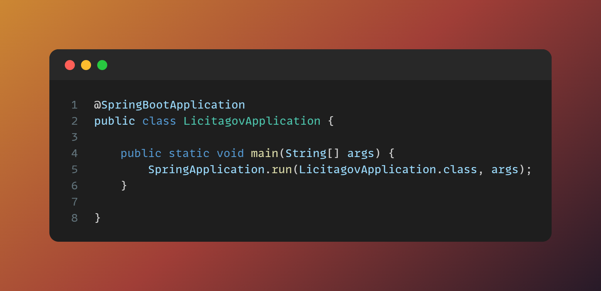

# 📰 Licitagov
 
<div style="margin: auto; width:70%">
    
</div>

### Ajustes e melhorias

O projeto ainda está em desenvolvimento e as próximas atualizações serão voltadas nas seguintes tarefas:

- [X] Implementação H2
- [X] Autenticação && Autorização
- [X] Consumo API - GOV
- [X] Persistência dos dados da API
- [X] Leitura e disponibilização dos dados
- [X] Liberação CORS

## 📃 Documentação

Documentação ficará disponível após a subida da aplicação em <a href="http://localhost:8080/documentation"> Documentação </a>

## 💻 Pré-requisitos

Antes de começar, verifique se você atendeu aos seguintes requisitos:
* Você precisará de:  
*  `Java 17` ☕ 
*  `Maven`   🐦

## 🚀 Instalando a aplicação

Para instalar o app, siga estas etapas:


```
mvn wrapper:wrapper
```

```
./mvnw clean install
```

## ▶️ Subindo a aplicação

Para usar Licitagov, siga estas etapas:

```
./mvnw spring-boot:run -D"spring-boot.run.jvmArguments"="-Dspring.profiles.active=develop"
```


## 🤝 Colaboradores

<table>
  <tr>
    <td align="center">
      <a href="#">
        <br>
        <sub>
          <b>Antonio Junior</b>
        </sub>
      </a>
    </td>
  </tr>
</table>
